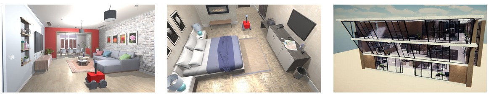
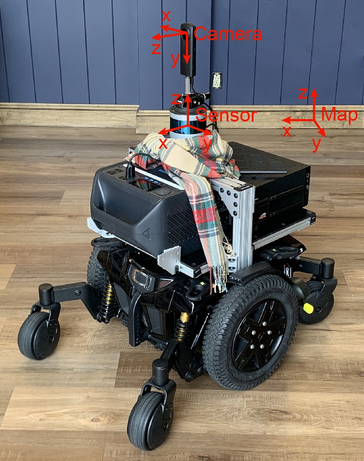
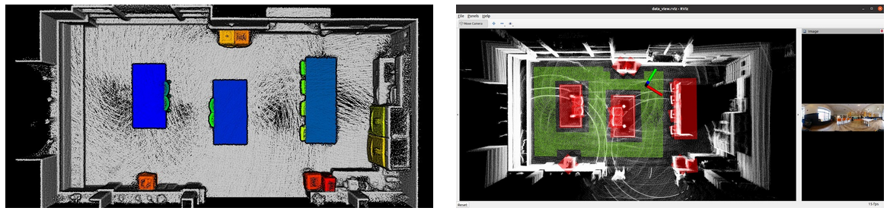

# CMU-VLA-Challenge

## Table of Contents
[Introduction](#introduction)  
[Objective](#objective)  
[Task Specification](#task-specification)

[Setting Up](#setting-up)
- [Challenge Scenes](#challenge-scenes)
- [Challenge Questions](#challenge-questions)
- [System](#system)
- [Simulator](#simulator)
- [Object-Referential Dataset](#object-referential-dataset-vla-3d)

[Real-Robot Challenge](#real-robot-challenge-2025)
- [Real-Robot Data](#real-robot-data)

[Submission](#submission)

[Evaluation](#evaluation)
- [Question Types and Initial Scoring](#question-types-and-initial-scoring)
- [Timing](#timing)

[Challenge FAQ](#challenge-faq)

## Introduction
The CMU Vision-Language-Autonomy Challenge leverages computer vision and natural language understanding in navigation autonomy. The challenge aims at pushing the limit of embodied AI in real environments and on real robots - providing a robot platform and a working autonomy system to bring everybody's work a step closer to real-world deployment. The challenge provides a real-robot system equipped with a 3D lidar and a 360 camera. The system has base autonomy onboard that can estimate the sensor pose, analyze the terrain, avoid collisions, and navigate to waypoints. Teams will set up software on the robot's onboard computer to interface with the system and navigate the robot. For 2024, the challenge will be done in a custom simulation environment and move to the real-robot system the following year. 

To register for the challenge, please see our [Challenge Website](https://www.ai-meets-autonomy.com/cmu-vla-challenge).

## Objective 
Teams are expected to come up with a vision-language model that can take a natural language navigation query and navigate the vehicle system by generating a waypoint or path based on the query.

## Task Specification
In the challenge, teams are provided with a set of natural language questions/statements for scenes from Unity [1]. The team is responsible for developing software that processes the questions together with onboard data of the scene provided by the system. The questions/statements all contain a spatial reasoning component that requires semantic spatial understanding of the objects in the scene. The environment is initially unknown and the scene data is gathered by navigating to appropriate viewpoints and exploring the scene by sending waypoints to the system. 5 questions/statements are provided for each of 15 Unity scenes and 3 scenes are held out for test evaluation.

The natural language questions are separated into three categories: numerical, object reference, and instruction following, which are further described below.

**Numerical**

Numerical questions asks about the quantity of an object that fits certain attributes or spatial relations. The response is expected to be an integer number.

Examples:

    How many blue chairs are between the table and the wall?

    How many black trash cans are near the window? 

**Object Reference**

Object reference statements asks the system to find a certain object located in the scene that is referred to by spatial relations and/or attributes. The response is expected to be a bounding box around the object and there exists only one correct answer in the scene (the referred object is unique). The center point of the bounding box marker will be used as a waypoint to navigate the robot system.

Examples:

    Find the potted plant on the kitchen island that is closest to the fridge.

    Find the orange chair between the table and sink that is closest to the window.

**Instruction-Following**

Instruction following statements ask the system to take a certain path, using objects to specify the trajectory of the path. The response is expected to be a sequence of waypoints.

Examples:

    Take the path near the window to the fridge.

    Avoid the path between the two tables and go near the blue trash can near the window.

## Setting Up
First, clone this repo and place it under your local `/home/$USER/` folder.

### Challenge Scenes
A total of 18 Unity scenes are used for the challenge. 15 scenes are provided for model development while 3 are held out for testing. The majority of these scenes are single rooms while a few are multi-room buildings.  A set of the training environment models can be downloaded from [here](https://drive.google.com/drive/folders/1bmxdT6Oxzt0_0tohye2br7gqTnkMaq20?usp=share_link). For all of the 15 training scenes, we also provide a processed point cloud of the scene, object and region information including color and size attributes, and referential language statements (please see [Object-Referential Dataset](#object-referential-dataset-vla-3d) for more details). 

### Challenge Questions
A set of challenge questions for each Unity scene is provided in the pdf files for each of the 15 training scenes under the [questions](questions/) folder. Images of the correct answer in each scene are also provided for visualization purposes and a .ply file of the target trajectory is provided as well. All questions for all training scenes can also be found in JSON format under [questions/questions.json](questions/questions.json).

### System

Our system runs on Ubuntu 20.04 and uses ROS Noetic in both simulation and onboard the real robot. Follow the instructions in the [docker/](docker/) folder to try the simulator by pulling the docker image provided and launching the system.

The system uses Unity environments by default and has two parts:
- The base navigation system is in the [system/unity](system/unity/) folder. This system can be launched by itself without the AI module running. For the base navigation system, you may change the scene used by placing it in the [system/unity/src/vehicle_simulator/mesh/unity/](system/unity/src/vehicle_simulator/mesh/unity/) directory.
- The vision-language model should be in the [ai_module](ai_module/) folder. The model currently in the folder under [ai_module/src](ai_module/src) is a "dummy model" that demonstrates how to read input questions and produces arbitrary examples of the different types of output responses which are to be used by the system and the evaluation node. **Teams are expected to come up with a model to replace this one.**

Launching the system startup script [launch.sh](launch.sh) will, by default, launch both the unity simulator and the dummy model. 

#### Dummy Model

The dummy model will read a question as a ROS String message on the `/challenge_question` topic. The dummy model will then either publish an integer as an Int32 message, send bounding box visualization markers for object reference, or waypoints to guide vehicle navigation. The three types of messages are listed below. To integrate the a model with the system, please modify the system startup script.
- Numerical response: ROS Int32 message on topic `/numerical_response`, containing an integer answering a numerical question.
- Visualization marker: ROS Marker message on topic `/selected_object_marker`, containing object label and bounding box of the selected object.
- Waypoint: ROS Pose2D message on topic `/way_point_with_heading` (neglect the heading for this year’s challenge).

#### System Outputs
The system provides onboard data to the AI module as shown in the table below:

| Message | Description | Frequency | Frame | ROS Topic Name |
|-|-|-|-|-|
| Image | ROS Image message from the 360 camera. The image is at 1920/640 resolution with 360 deg HFOV and 120 VFOV. | 10Hz | camera | `/camera/image` |
| Registered Scan | ROS PointCloud2 message from the 3D lidar and registered by the state estimation module. | 5Hz | map | `/registered_scan` |
| Sensor Scan | ROS PointCloud2 message from the 3D lidar. | 5Hz | sensor_at_scan | `/sensor_scan` |
| Local Terrain Map | ROS PointCloud2 message from the terrain analysis module around the vehicle. | 5Hz | map | `/terrain_map` (5m around vehicle)   `/terrain_map_ext` (20m around vehicle) |
| Sensor Pose| ROS Odometry message from the state estimation module. | 100-200Hz | from map to sensor | `/state_estimation` |
| Traversable Area| ROS PointCloud2 message containing the traversable area of the entire environment. | 5Hz | map | `/traversable_area` |
| Ground-Truth Semantics| ROS MarkerArray message containing object labels and bounding boxes within 2m around the vehicle. | 5Hz | map | `/object_markers` |

**IMPORTANT NOTE**: While more topics may be available from the system, these are the only ones allowed to be used during test time. During training/development, you are free to use whatever information the system simulator provides.

#### System Inputs

The system takes waypoints output from the AI module to navigate the robot. Waypoints located in the traversable area (listed above) are accepted directly, and waypoints out of the traversable area are adjusted and moved into the traversable area. The system also takes visualization markers output by the module to highlight selected objects. Int32 messages indicating a numerical response are not directly used by the system to navigate the robot, and are read instead by the evaluation node detailed in the [evaluation](#evaluation) section.

The table below lists the ROS topics to use. The waypoints should be used for Instruction-Following questions, the visualization marker should be the output for the Object Reference questions, and the integers for Numerical questions.

| Message | Description | ROS Topic Name |
|-|-|-|
| Waypoint with Heading | ROS Pose2D message with position and orientation. | `/way_point_with_heading` |
| Selected Object Marker | ROS Marker message containing object label and bounding box of the selected object. | `/selected_object_marker` |
| Numerical Response | ROS Int32 message with an integer as an answer to a numerical question. | `/numerical_response` |

The coordinate frames used by the physical system are shown below. The camera position (camera frame) with respect to the lidar (sensor frame) is measured based on a CAD model. The orientation is calibrated and the images are remapped to keep the camera frame and lidar frame aligned. 

  

### Simulator

In addition to the simulation system described above based on Unity, a second simulator is provided based on AI Habitat and uses Matterport3D environment models, which can be found under [matterport/](system/matterport/). Similarly, the system can be launched, synthesized data can be retrieved, and sending waypoints will navigate the robot in simulation. As a quick example, the command line below sends a waypoint to the system at 1m away from the start point. 

`rostopic pub -1 /way_point_with_heading geometry_msgs/Pose2D '{x: 1.0, y: 0.0, theta: 0.0}'`

Note that the simulation system provided a broader scope of data than the actual challenge but the data can be used to help prepare the AI module. During the challenge, only data listed above in [System](#system) is provided, matching the data onboard the real robot.

### Object-Referential Dataset (VLA-3D)

To help with the subtask of referential object-grounding, the VLA-3D dataset containing 7.6K indoor 3D scenes with over 11K regions and 9M+ statements is provided. The dataset includes processed scene point clouds, object and region labels, a scene graph of semantic relations, and generated language statements for each 3D scene from a diverse set of data sources and includes the 15 training scenes in Unity. For access to the data and more details on the format, please see our [VLA-3D repository](https://github.com/HaochenZ11/VLA-3D).

## Real-Robot Challenge (2025)

Starting in 2025, the final round of challenge evaluation will be done on the real-robot system while initial evaluation rounds are still done in simulation. Similar to the simulator, the system provides onboard data as described below and takes waypoints in the same way as the simulator. The software developed in the AI module is only able to send waypoints to explore the scene. Manually sending waypoints or teleoperation is not allowed. During the final evaluation phase, each team will remotely login to the robot's onboard computer (16x i9 CPU cores, 32GB RAM, RTX 4090 GPU), and set up software in a Docker container that interfaces with the autonomy modules. The Docker container is used by each team alone and not shared with other teams. We will schedule time slots for teams who pass the simulation round to set up the software and test the robot during that phase. The teams can also record data on the robot's onboard computer and this data will be made available to participants afterwards.

### Real-Robot Data

Example scene data collected from the real system is provided [here](https://drive.google.com/drive/folders/1M0_UkY7aDIEpoVK6GdWzg45v-HX2UMSd?usp=drive_link) with some differences in the object layout. The following can be found in the sample data:

- `data_view.rviz`: An RVIZ configuration file provided for viewing the data
- `map.ply`: A ground truth map with object segmentation and IDs
- `object_list.txt`: Object list with bounding boxes and labels are also provided
- `system.zip`: Zipped bagfile with ROS messages provided by the system in the same format as during the challenge
- `readme.txt`: Calibration information and further details about the sample files

Here, the ground truth map and the object list are not provided files during the challenge but shown as a sample of what information can be obtained and processed from the system. The camera pose (camera frame) with respect to the lidar (sensor frame) can be found in the README file included. Further details about the files can be found in the README text file as well.

## Submission
Submissions will be made as a github repository link to a public repository. The easiest way would be to fork this repository and make changes there, as the repository submitted will need to be structured in the same way. The only files/folders that should be changed are what's under [ai_module](ai_module/) and potentially the [launch.sh](launch.sh). If changes were made to the docker image to install packages, push the updated image to [Docker Hub](https://hub.docker.com/) and submit the link to the image as well.

Prior to submitting, please download the docker image and test it with the simulator as the submission will be evaluated in the same way. Please also make sure that waypoints and visualization markers sent match the types in the example dummy model and are on the same ROS topics so that the base navigation system can correctly receive them.

Please fill out the [Submission Form](https://docs.google.com/forms/d/e/1FAIpQLSfcKWEV3ReuGEfGag0En706KDtgxjFDayE6dJIgWElQrXiDmw/viewform?usp=sharing&ouid=113649899278879140488) with a link to your Github repo.

## Evaluation
The submitted code will be pulled and evaluated with 3 Unity environment models which have been held from the released data. Each scene will be unknown and the module has a set amount of time to explore and answer the question (see [timing](#timing) for more details). The test scenes are of similar style to the provided training scenes. **The system will be relaunched for each language command tested such that information collected from previously exploring the scene is not retained.** Note that the information onboard the system that is allowed to be used at test time is limited to what is listed in [System Outputs](#system-outputs).

Evaluation is performed by a `challenge_evaluation_node` whose source code is not made public. The evaluation node will be started along with the team-provided AI module and the system at the same time, and publishes a single question each startup as a ROS String message on the following topic at a rate of 1Hz:

| Message | Description | Frequency | ROS Topic Name |
|-|-|-|-|
| Challenge Question | ROS Pose2D message with position and orientation. | 1Hz | `/challenge_question` |

### Question Types and Initial Scoring

For each scene, 5 questions similar to those provided will be tested and a score will be given to each response. The question types will be scored as follows:
- **Numerical** (/1): Exact number must be published on `/numerical_response` as an `std_msgs/Int32` message. Score of 0 or 1.
- **Object Reference** (/2): ROS `visualization_msgs/Marker` message must be published on `/selected_object_marker`, and is scored based on its degree of overlap with the ground truth object bounding box. Score between 0 and 2.
- **Instruction-Following** (/6): A series of `geometry_msgs/Pose2D` waypoints must be published on `/way_point_with_heading` to guide the vehicle. The score will be calculated based on the actual trajectory followed by the robot based on whether it follows the path constraints in the command and in the correct order. Penalties are imposed upon the score if the followed path deviates from the correct order of constraints, does not achieve the desired constraints, or passes through areas it is forbidden to go through in the command. Score between 0 and 6, with possibility for partial points. 

The scores from all questions across the 3 test scenes will be totaled for each team's final score. 

Note: Teams have a choice whether to use the ground-truth semantics posted on the /object_markers topic in their final submission. Methods that do not use the published ground-truth semantics will be scored differently.

### Timing

For each question, both re-exploration on system launch and question answering will be timed. Timing will begin immediately at system startup. Each question has a total time limit of **10 minutes** for exploration and question answering combined, regardless of the test scene. Exceeding the time limit for a certain question incurs a penalty on the initial score calculated for the question. Finishing before the allotted time for a question earns bonus points on that question, which will be used to break ties between teams with similar initial scores.

## Challenge FAQ
Any questions regarding the challenge can be asked by opening a Github issue with the "question" label. We encourage you to use this feature so that multiple members of the team can see the question. Questions specific to your team situation can be emailed to haochen4@andrew.cmu.edu or other challenge organizers. Frequently asked questions will be posted here.

1. Are multiple submissions allowed?

    Yes, there is no limit to the number of submissions allowed during the competition. The submission form is set up to allow multiple submissions and we will take your highest scoring one.

2. What are the time constraints for completing the task?

    Please check the [timing](#timing) section.

3. Any restrictions on the usage of LLMs/VLMs/APIs?

    There are no restrictions on using LLMs, VLMs, or online APIs. Any model can be used, however, keep in mind that we will need to be able to run your code and if it needs to query online APIs during runtime, you will have to provide your access token in your code.

4. What is the docker size limit?

    The size limitation depends on the machine we use to run evaluation. The specs for the machine can be found [HERE](https://simplynuc.com/product/nuc13rngi9-full/?gad_source=1&gclid=CjwKCAjwiaa2BhAiE[%E2%80%A6]g4P7AnhLOZQVIoVC9croO7-i74DfuezIOztALzi5RVJ3jv3bxoCxmEQAvD_BwE).

5. How will real-robot evaluation work?
   
   All submissions will first be evaluated in simulation first. Valid submissions will then be evaluated on the real-robot system and teams will be invited to schedule a timeslot and connect remotely to assist with the integration and evaluation.

6. Will ground-truth semantics be provided in the real-robot evaluation?

   Yes, ground-truth semantics will be provided in the real-world scene as well. Participants have a choice whether to use ground-truth semantics in their final submission or not and indicate this in the submission form. Methods that use it vs. methods that do not will be scored differently.

8. How will presentation at the IROS workshop work?

   All evaluation will be conducted prior to the IROS conference. The top 3 teams will be contacted with the opportunity to present their method either in-person or remotely.

## Acknowledgements
Thank you to [AlphaZ](https://alpha-z.ai/) for sponsoring the challenge for 2025! Their generous support enables us to provide the top three teams with a cash prize.

## References

[1] J. Haas. "A history of the unity game engine," in Diss. Worcester Polytechnic Institute, vol. 483, no. 2014, pp. 484, 2014.
